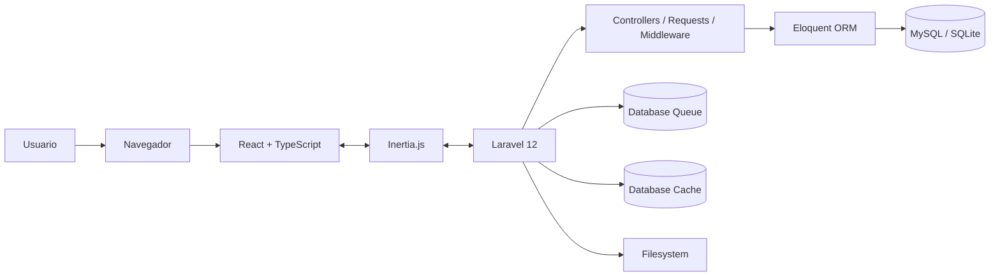
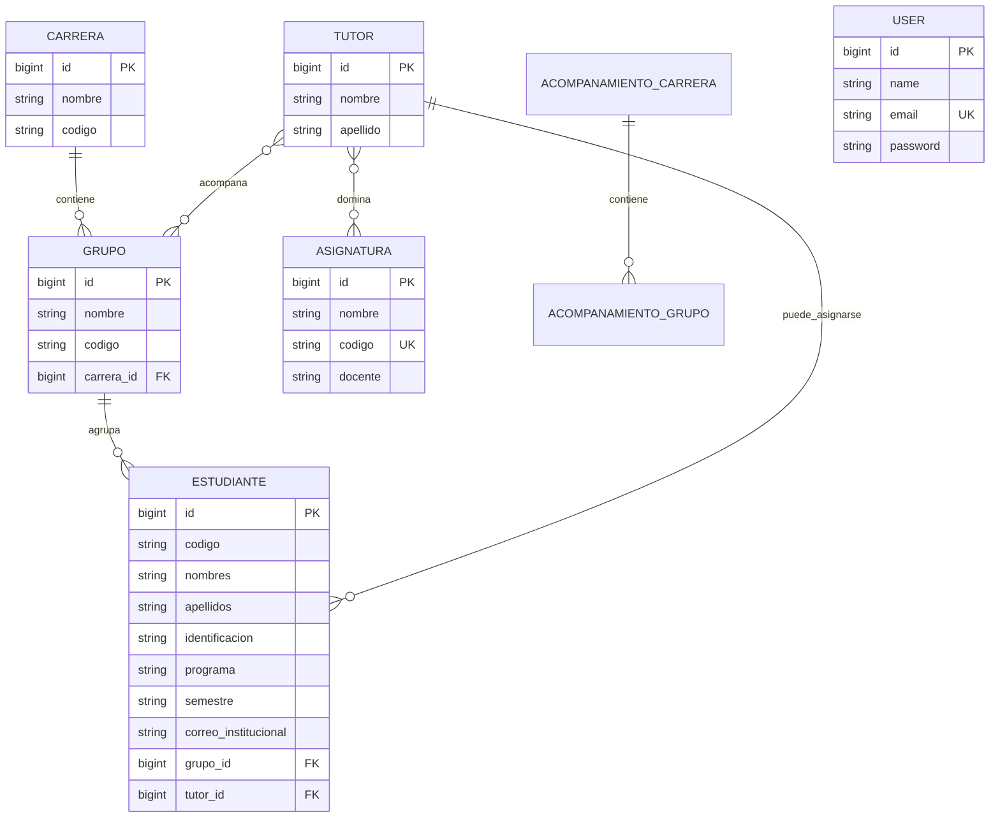

# Sistema de Gestión de Información para Bienestar Universitario

> **Universidad de La Guajira — Sede Maicao**  
> Proyecto académico y prototipo funcional para apoyar la gestión del área de **Bienestar Universitario**, con énfasis en los procesos de **Permanencia y Graduación Exitosa**.


---

## Tabla de contenidos

- [Descripción](#descripción)
- [Problema que resuelve](#problema-que-resuelve)
- [Objetivos](#objetivos)
- [Alcance institucional](#alcance-institucional)
- [Estado actual del proyecto](#estado-actual-del-proyecto)
- [Funcionalidades implementadas](#funcionalidades-implementadas)
- [Funcionalidades planteadas en la investigación](#funcionalidades-planteadas-en-la-investigación)
- [Arquitectura](#arquitectura)
- [Stack tecnológico](#stack-tecnológico)
- [Modelo de datos](#modelo-de-datos)
- [Estructura del repositorio](#estructura-del-repositorio)
- [Rutas principales](#rutas-principales)
- [Importación de estudiantes desde Excel](#importación-de-estudiantes-desde-excel)
- [Autenticación y seguridad](#autenticación-y-seguridad)
- [Procesos asíncronos, colas y caché](#procesos-asíncronos-colas-y-caché)
- [Pruebas y calidad de código](#pruebas-y-calidad-de-código)
- [Integración continua](#integración-continua)
- [Instalación local](#instalación-local)
- [Configuración con MySQL](#configuración-con-mysql)
- [Comandos útiles](#comandos-útiles)
- [Despliegue](#despliegue)
- [Metodología de investigación](#metodología-de-investigación)
- [Hallazgos que dieron origen al sistema](#hallazgos-que-dieron-origen-al-sistema)
- [Limitaciones y trabajo pendiente](#limitaciones-y-trabajo-pendiente)
- [Roadmap](#roadmap)
- [Autores](#autores)
- [Licencia](#licencia)

---

## Descripción

Este proyecto corresponde a la **implementación de un Sistema de Gestión de Información para el Área de Bienestar Universitario de la Universidad de La Guajira, sede Maicao**.

La iniciativa nace de la necesidad de reemplazar procesos manuales, información dispersa y mecanismos de seguimiento poco estandarizados por una plataforma web centralizada que facilite la gestión de estudiantes, tutores, asignaturas, carreras, grupos y procesos de acompañamiento académico.

El sistema está orientado especialmente al componente de **Permanencia y Graduación Exitosa**, cuyo propósito institucional es apoyar a los estudiantes durante su trayectoria académica y contribuir a disminuir el riesgo de deserción.

La solución combina un backend en **Laravel** con una interfaz SPA construida en **React + TypeScript**, conectados mediante **Inertia.js**. Esta arquitectura permite conservar las rutas, controladores, validaciones y modelos de Laravel sin mantener una API REST independiente para la mayoría de operaciones.

---

## Problema que resuelve

Durante el diagnóstico del Área de Bienestar Universitario se identificaron problemas como:

- Procesos administrativos predominantemente manuales y desarticulados.
- Información de estudiantes, tutores y seguimientos almacenada de forma dispersa.
- Duplicación de datos y esfuerzos administrativos.
- Dificultad para consultar información de manera rápida y centralizada.
- Falta de estandarización en los reportes posteriores a las tutorías.
- Dificultad para medir la efectividad del acompañamiento académico.
- Falta de trazabilidad de las asignaciones realizadas.
- Distribución poco equilibrada de estudiantes entre tutores.
- Ausencia de criterios sistemáticos para apoyar la asignación de tutores.
- Necesidad de mejores indicadores para la toma de decisiones.
- Necesidad de una interfaz sencilla que reduzca la resistencia al cambio tecnológico.

El proyecto busca convertir estos procesos en información estructurada y disponible para el personal encargado de Bienestar Universitario.

---

## Objetivos

### Objetivo general

Implementar un sistema de gestión de información para el Área de Bienestar Universitario de la **Universidad de La Guajira — Sede Maicao**.

### Objetivos específicos

1. Analizar el proceso actual del Área de Bienestar Universitario.
2. Identificar los requerimientos técnicos necesarios para el desarrollo del sistema.
3. Establecer una arquitectura de software adecuada para la solución.
4. Desarrollar y mostrar un sistema funcional que permita apoyar la gestión de los procesos identificados.

---

## Alcance institucional

El proyecto se concentra en la **Universidad de La Guajira — Sede Maicao**, particularmente en el área de Bienestar Universitario.

Dentro del componente de **Permanencia y Graduación Exitosa**, la investigación identifica cuatro líneas de servicio relevantes:

1. **Promoción a la Graduación**  
   Orientación y seguimiento a estudiantes de últimos semestres para la selección y desarrollo de modalidades de grado.

2. **Acompañamiento en el Aprendizaje**  
   Apoyo a estudiantes de primeros semestres o con dificultades académicas mediante actividades de fortalecimiento de competencias.

3. **Atención a Estudiantes Repitentes**  
   Seguimiento a estudiantes con asignaturas reprobadas y definición de estrategias de acompañamiento.

4. **Tutorías en materias de alta repetición**  
   Apoyo académico dirigido a asignaturas con mayores niveles de repitencia, con el propósito de reducir el riesgo de abandono.

---

## Estado actual del proyecto

El repositorio contiene un **prototipo funcional en desarrollo**. Parte de las necesidades definidas durante la investigación ya se encuentran implementadas y otras continúan como funcionalidades proyectadas.

### Implementado en el código actual

- Autenticación de usuarios.
- Registro y administración de tutores.
- Registro y administración de asignaturas.
- Relación muchos-a-muchos entre tutores y asignaturas.
- Registro y administración de carreras.
- Registro y administración de grupos.
- Relación de grupos con carreras.
- Registro de estudiantes mediante importación desde Excel.
- Consulta de estudiantes por grupo.
- Edición y eliminación de estudiantes.
- Asignación manual de tutores a grupos.
- Relación muchos-a-muchos entre tutores y grupos.
- Perfil básico del tutor.
- Módulo inicial para carreras de acompañamiento.
- Interfaz administrativa con sidebar, tarjetas de métricas y tablas reutilizables.
- Preferencias de apariencia del usuario.
- Gestión de perfil y cambio de contraseña.
- Recuperación y restablecimiento de contraseña.
- Infraestructura base para colas, caché, sesiones y trabajos fallidos en base de datos.
- Pruebas automatizadas de autenticación, perfil, contraseña y dashboard.
- Workflows de GitHub Actions para pruebas y calidad de código.

### Aún no completamente implementado

- Asignación automática de tutores mediante criterios de carga, experiencia, asignatura y perfil del estudiante.
- Motor de alertas tempranas.
- Reportes institucionales completos y estadísticas de permanencia.
- Seguimiento quincenal de tutorías con formularios estandarizados.
- Evaluación de efectividad de tutorías y tutores.
- Gestor documental institucional completo.
- Control de acceso por roles y permisos.
- Panel principal con indicadores reales; el dashboard actual conserva componentes placeholder.
- Automatización integral del proceso de Permanencia y Graduación Exitosa.

> **Importante:** la documentación académica describe la visión completa del sistema. Este README diferencia esa visión del estado real del repositorio para evitar presentar como terminadas funcionalidades que todavía forman parte del roadmap.

---

## Funcionalidades implementadas

### 1. Gestión de tutores

El módulo de tutores permite:

- Crear tutores.
- Editar tutores.
- Eliminar tutores.
- Consultar el listado de tutores.
- Visualizar el perfil individual de un tutor.
- Asociar una o varias asignaturas a cada tutor.

La relación entre `Tutor` y `Asignatura` es de **muchos a muchos** mediante la tabla pivote `asignatura_tutor`.

### 2. Gestión de asignaturas

Permite:

- Crear asignaturas.
- Definir nombre, código y docente.
- Editar asignaturas.
- Eliminar asignaturas.
- Asociarlas a tutores.

El código de la asignatura se almacena como un valor único en base de datos.

### 3. Gestión de carreras

Permite registrar y administrar las carreras académicas utilizadas para organizar grupos y estudiantes.

Cada carrera contiene:

- Nombre.
- Código.

### 4. Gestión de grupos

Permite:

- Crear grupos.
- Editar grupos.
- Eliminar grupos.
- Asociar cada grupo a una carrera.
- Consultar el detalle del grupo.
- Consultar sus estudiantes.
- Asociar tutores al grupo.

La relación entre `Grupo` y `Tutor` es muchos-a-muchos mediante `grupo_tutor`.

### 5. Gestión de estudiantes

Los estudiantes pueden ser cargados masivamente mediante archivos `.xlsx` o `.xls`.

El sistema:

1. Valida el grupo de destino.
2. Valida el formato del archivo.
3. Lee el Excel con **PhpSpreadsheet**.
4. Omite la primera fila como encabezado.
5. Actualiza o crea registros utilizando la identificación del estudiante como criterio lógico de búsqueda.
6. Vincula los estudiantes al grupo seleccionado.

También se encuentran disponibles operaciones de edición y eliminación.

### 6. Asignación de tutores a grupos

Desde el detalle de un grupo se puede seleccionar un tutor y asociarlo al grupo.

Actualmente esta asignación es **manual**. El backend usa `syncWithoutDetaching()` para agregar la relación sin eliminar tutores previamente asociados.

### 7. Acompañamiento

Existe una estructura inicial independiente para administrar:

- Carreras de acompañamiento.
- Grupos de acompañamiento.

Esta parte del sistema todavía requiere integración funcional adicional con el flujo completo de estudiantes, tutorías y seguimiento.

### 8. Interfaz y experiencia de usuario

El frontend contiene:

- Layout administrativo con sidebar colapsable.
- Componentes de UI basados en shadcn/ui y Radix UI.
- Tablas reutilizables con TanStack React Table.
- Tarjetas de métricas.
- Componentes de gráficas con Recharts.
- Animaciones con Framer Motion.
- Iconografía con Lucide React y React Icons.
- Soporte para temas claro/oscuro mediante variables CSS.
- Componentes responsivos construidos con Tailwind CSS.

---

## Funcionalidades planteadas en la investigación

Los requerimientos levantados durante la investigación establecen como visión funcional del sistema:

- Base de datos institucional centralizada.
- Automatización de la asignación de tutores.
- Validación de carga académica.
- Historial de asignaciones y trazabilidad.
- Gestión de formatos institucionales.
- Carga y descarga de documentos de seguimiento.
- Informes quincenales.
- Evaluaciones de tutorías.
- Reportes de cumplimiento.
- Indicadores de efectividad.
- Estadísticas por carrera, semestre, asignatura y nivel de repitencia.
- Seguimiento individual del estudiante.
- Alertas tempranas.
- Herramientas de apoyo a la toma de decisiones.

Estas características conforman el roadmap natural del prototipo.

---

## Arquitectura

El sistema utiliza una arquitectura **cliente-servidor** con experiencia de **Single Page Application (SPA)**.



### Capa de presentación

- React.
- TypeScript.
- Inertia React.
- Tailwind CSS.
- shadcn/ui / Radix UI.
- TanStack React Table.
- Recharts.
- Framer Motion.

### Capa de aplicación

Laravel concentra:

- Rutas.
- Controladores.
- Validación de solicitudes.
- Autenticación.
- Sesiones.
- Lógica de negocio.
- Persistencia mediante Eloquent ORM.
- Colas y caché.

### Comunicación

La aplicación no necesita una API REST separada para sus operaciones CRUD principales. **Inertia.js** actúa como puente entre Laravel y React.

Algunas operaciones específicas pueden retornar JSON; por ejemplo, la asignación de un tutor a un grupo utiliza una solicitud HTTP desde Axios.

### Capa de persistencia

La investigación define **MySQL** como base de datos relacional objetivo. El repositorio también incluye **SQLite como configuración predeterminada para desarrollo**, lo que permite iniciar el proyecto con menor configuración local.

---

## Stack tecnológico

### Backend

| Tecnología | Uso |
|---|---|
| PHP `^8.2` | Lenguaje del backend |
| Laravel `^12.0` | Framework principal |
| Eloquent ORM | Acceso y modelado de datos |
| Inertia Laravel `^2.0` | Integración backend/frontend |
| Ziggy `^2.4` | Integración de rutas Laravel en JavaScript |
| PhpSpreadsheet `^4.1` | Lectura e importación de archivos Excel |
| Laravel Tinker | Consola interactiva |

### Frontend

| Tecnología | Uso |
|---|---|
| React `18.3.x` | Construcción de interfaces |
| React DOM `18.3.x` | Renderizado de React |
| TypeScript `5.7.x` | Tipado estático |
| Inertia React `2.x` | Navegación SPA conectada con Laravel |
| Tailwind CSS `4.x` | Estilos utilitarios |
| shadcn/ui | Base de componentes reutilizables |
| Radix UI | Primitivos accesibles para componentes |
| TanStack React Table `8.x` | Tablas y manejo de datos |
| Recharts `2.x` | Gráficas y visualizaciones |
| Framer Motion `12.x` | Animaciones |
| Lucide React | Iconos |
| React Icons | Iconos adicionales |
| React Select | Selectores avanzados |
| React Day Picker | Componentes de calendario |
| date-fns | Utilidades de fechas |
| Sonner | Notificaciones/toasts disponibles |
| Axios | Solicitudes HTTP puntuales |
| jQuery + Owl Carousel | Carrusel usado en la vista pública actual |

### Build y herramientas de desarrollo

| Herramienta | Uso |
|---|---|
| Vite `6.x` | Bundler y servidor de desarrollo frontend |
| Laravel Vite Plugin | Integración Laravel/Vite |
| `@vitejs/plugin-react` | Compilación React |
| npm | Gestión de dependencias JS |
| Composer | Gestión de dependencias PHP |
| Concurrently | Ejecución paralela de servidor, cola y Vite |

### Calidad

| Herramienta | Uso |
|---|---|
| Pest `3.x` | Pruebas automatizadas |
| PHPUnit | Base de pruebas PHP |
| Laravel Pint | Formato/estilo del backend |
| ESLint `9.x` | Lint del frontend |
| Prettier `3.x` | Formato del frontend |
| TypeScript Compiler | Verificación de tipos |
| Faker | Generación de datos de prueba |
| Mockery | Mocks para pruebas |

### Infraestructura disponible

| Componente | Estado |
|---|---|
| Git | Control de versiones esperado para el repositorio |
| GitHub Actions | CI para pruebas y calidad |
| Laravel Queue | Configurada con driver `database` |
| Laravel Cache | Configurado con store `database` |
| Sesiones | Configuradas en base de datos |
| Filesystem | Local por defecto, S3 configurable |
| Redis | Soportado por configuración, no requerido actualmente |
| Laravel Sail | Dependencia de desarrollo disponible |
| Docker Compose | No se encontró archivo de composición en el repositorio actual |
| Reverse proxy | No se encontró configuración Nginx/Apache específica de producción en el repositorio |

---

## Modelo de datos

Las entidades principales encontradas en el código son:

- `User`
- `Tutor`
- `Asignatura`
- `Carrera`
- `Grupo`
- `Estudiante`
- `AcompanamientoCarrera`
- `AcompanamientoGrupo`
- `Nota` *(estructura inicial sin lógica de dominio implementada)*

### Relaciones principales



### Tablas pivote

- `asignatura_tutor`
- `grupo_tutor`

Además, Laravel crea tablas de infraestructura para:

- sesiones;
- caché;
- locks de caché;
- jobs;
- lotes de jobs;
- jobs fallidos;
- tokens de recuperación de contraseña.

---

## Estructura del repositorio

```text
.
├── app/
│   ├── Http/
│   │   ├── Controllers/
│   │   │   ├── Auth/
│   │   │   ├── Settings/
│   │   │   ├── TutorController.php
│   │   │   ├── AsignaturaController.php
│   │   │   ├── CarreraController.php
│   │   │   ├── GrupoController.php
│   │   │   ├── EstudianteController.php
│   │   │   └── AcompanamientoCarreraController.php
│   │   ├── Middleware/
│   │   └── Requests/
│   └── Models/
├── bootstrap/
├── config/
├── database/
│   ├── factories/
│   ├── migrations/
│   └── seeders/
├── public/
├── resources/
│   ├── css/
│   ├── js/
│   │   ├── components/
│   │   │   ├── component/
│   │   │   └── ui/
│   │   ├── hooks/
│   │   ├── layouts/
│   │   ├── lib/
│   │   ├── pages/
│   │   │   ├── Acompanamiento/
│   │   │   ├── Estudiantes/
│   │   │   ├── Tutores/
│   │   │   ├── auth/
│   │   │   └── settings/
│   │   └── types/
│   └── views/
├── routes/
│   ├── auth.php
│   ├── settings.php
│   └── web.php
├── storage/
├── tests/
│   ├── Feature/
│   └── Unit/
├── .github/workflows/
│   ├── lint.yml
│   └── tests.yml
├── composer.json
├── package.json
├── vite.config.ts
├── phpunit.xml
├── components.json
└── Procfile
```

---

## Rutas principales

### Públicas

| Método | Ruta | Descripción |
|---|---|---|
| GET | `/` | Página pública inicial |
| GET | `/graduacion` | Página pública de graduación en desarrollo |
| GET/POST | `/login` | Inicio de sesión |
| GET/POST | `/register` | Registro |
| GET/POST | `/forgot-password` | Recuperación de contraseña |
| GET/POST | `/reset-password/...` | Restablecimiento de contraseña |

### Protegidas por autenticación

| Ruta | Uso |
|---|---|
| `/dashboard` | Panel principal |
| `/tutores` | CRUD de tutores |
| `/tutores/{tutor}/perfil` | Perfil del tutor |
| `/asignaturas` | CRUD de asignaturas |
| `/carreras` | CRUD de carreras |
| `/grupos` | CRUD de grupos |
| `/estudiantes` | Gestión de estudiantes |
| `/estudiantes/grupos/{grupo}` | Detalle de estudiantes de un grupo |
| `/estudiantes/cargar-excel` | Importación masiva de estudiantes |
| `/grupos/{grupo}/asignar-tutor` | Asociación de tutor al grupo |
| `/acompañamientos` | CRUD inicial de carreras de acompañamiento |
| `/settings/profile` | Perfil del usuario |
| `/settings/password` | Cambio de contraseña |
| `/settings/appearance` | Preferencias de apariencia |

---

## Importación de estudiantes desde Excel

El backend utiliza **PhpSpreadsheet** para procesar archivos `.xlsx` y `.xls`.

La primera fila se considera encabezado y se omite. El código actual espera las siguientes columnas:

| Columna | Campo |
|---|---|
| A | Número |
| B | Código |
| C | Apellidos |
| D | Nombres |
| E | Tipo de identificación |
| F | Identificación |
| G | Ciudad de expedición |
| H | Sexo |
| I | Programa |
| J | Semestre |
| K | Correo institucional |

La importación está asociada al grupo seleccionado desde la interfaz.

> Antes de utilizar archivos institucionales reales, se recomienda validar formatos, duplicados, valores obligatorios y políticas de protección de datos personales.

---

## Autenticación y seguridad

El sistema utiliza la autenticación nativa de Laravel basada en sesiones y Eloquent.

El repositorio incluye:

- Registro de usuarios.
- Inicio y cierre de sesión.
- Recuperación de contraseña.
- Restablecimiento de contraseña.
- Confirmación de contraseña.
- Flujo de verificación de correo disponible en el starter kit.
- Hash automático de contraseñas mediante Laravel.
- Protección CSRF.
- Validaciones de formularios en controladores y Form Requests.
- Middleware `auth` para proteger los módulos internos.
- Sesiones persistidas en base de datos por defecto.

### Roles y permisos

La documentación del proyecto contempla control de acceso por roles como requisito de seguridad. Sin embargo, **el repositorio actual no contiene todavía una implementación de RBAC/roles/permisos**.

Para una implementación institucional se recomienda incorporar:

- Administrador.
- Coordinador de Bienestar.
- Tutor.
- Personal de seguimiento.
- Permisos por módulo y operación.
- Políticas de autorización de Laravel.
- Auditoría de operaciones sensibles.

---

## Procesos asíncronos, colas y caché

Laravel está configurado para utilizar:

```env
QUEUE_CONNECTION=database
CACHE_STORE=database
SESSION_DRIVER=database
```

El comando de desarrollo definido en Composer inicia simultáneamente:

- servidor Laravel;
- listener de colas;
- servidor Vite.

```bash
composer dev
```

Aunque la infraestructura para colas está disponible, **no se encontraron Jobs de dominio personalizados en el estado actual del repositorio**. Esto deja preparada la arquitectura para futuros procesos como:

- generación de reportes;
- importaciones masivas más pesadas;
- notificaciones;
- cálculo de indicadores;
- alertas tempranas.

---

## Pruebas y calidad de código

El proyecto utiliza **Pest** sobre la infraestructura de pruebas de Laravel.

Actualmente existen pruebas para:

- acceso a la página principal;
- autenticación;
- registro;
- cierre de sesión;
- verificación de correo;
- recuperación de contraseña;
- confirmación de contraseña;
- actualización de contraseña;
- actualización de perfil;
- eliminación de cuenta;
- protección del dashboard para usuarios invitados;
- acceso al dashboard para usuarios autenticados.

### Ejecutar pruebas

```bash
php artisan test
```

O directamente:

```bash
./vendor/bin/pest
```

### Calidad PHP

```bash
./vendor/bin/pint
```

### Formato frontend

```bash
npm run format
```

### Verificar formato

```bash
npm run format:check
```

### ESLint

```bash
npm run lint
```

### TypeScript

```bash
npm run types
```

> Las pruebas actuales se concentran principalmente en el starter kit de autenticación. Se recomienda ampliar la cobertura a tutores, estudiantes, grupos, importación de Excel y asignaciones.

---

## Integración continua

El repositorio incluye dos workflows de **GitHub Actions**.

### `tests.yml`

Se ejecuta en `push` y `pull_request` sobre las ramas:

- `develop`
- `main`

El pipeline:

1. Descarga el repositorio.
2. Configura PHP 8.4.
3. Configura Node.js 22.
4. Ejecuta `npm ci`.
5. Compila assets con `npm run build`.
6. Ejecuta `composer install`.
7. Copia `.env.example`.
8. Genera `APP_KEY`.
9. Ejecuta Pest.

### `lint.yml`

También se ejecuta sobre `develop` y `main` y realiza:

- instalación de dependencias;
- Laravel Pint;
- Prettier;
- ESLint.

---

## Instalación local

### Requisitos

- PHP 8.2 o superior.
- Composer 2.
- Node.js compatible con Vite 6. Para reproducir el CI se recomienda Node.js 22.
- npm.
- Extensiones PHP requeridas por Laravel.
- SQLite para la configuración rápida, o MySQL para trabajar con la base de datos definida en la arquitectura institucional.

### 1. Clonar el proyecto

```bash
git clone <URL_DEL_REPOSITORIO>
cd Bienestar-main
```

### 2. Instalar dependencias PHP

```bash
composer install
```

### 3. Instalar dependencias frontend

```bash
npm install
```

### 4. Crear el archivo de entorno

Linux/macOS:

```bash
cp .env.example .env
```

PowerShell:

```powershell
Copy-Item .env.example .env
```

### 5. Generar la clave de Laravel

```bash
php artisan key:generate
```

### 6. Preparar SQLite para desarrollo rápido

El `.env.example` utiliza SQLite por defecto.

```bash
php -r "file_exists('database/database.sqlite') || touch('database/database.sqlite');"
```

### 7. Ejecutar migraciones

```bash
php artisan migrate
```

Opcionalmente, cargar el seeder de desarrollo:

```bash
php artisan db:seed
```

El seeder actual crea un usuario de prueba mediante `UserFactory`.

### 8. Ejecutar la aplicación

La forma más cómoda es:

```bash
composer dev
```

Este comando ejecuta en paralelo:

- `php artisan serve`
- `php artisan queue:listen --tries=1`
- `npm run dev`

También es posible iniciar cada proceso manualmente:

```bash
php artisan serve
npm run dev
php artisan queue:listen
```

---

## Configuración con MySQL

Aunque el entorno de ejemplo usa SQLite, el diseño académico del sistema utiliza una base de datos relacional **MySQL**.

Ejemplo:

```env
DB_CONNECTION=mysql
DB_HOST=127.0.0.1
DB_PORT=3306
DB_DATABASE=bienestar_universitario
DB_USERNAME=root
DB_PASSWORD=
```

Luego:

```bash
php artisan config:clear
php artisan migrate
```

Para recrear completamente la base de datos durante desarrollo:

```bash
php artisan migrate:fresh --seed
```

> No utilice `migrate:fresh` en producción, ya que elimina las tablas existentes.

---

## Comandos útiles

### Desarrollo completo

```bash
composer dev
```

### Solo backend

```bash
php artisan serve
```

### Solo frontend

```bash
npm run dev
```

### Build de producción

```bash
npm run build
```

### Build con SSR

```bash
npm run build:ssr
```

### Desarrollo con SSR

```bash
composer dev:ssr
```

### Migraciones

```bash
php artisan migrate
```

### Limpiar cachés de Laravel

```bash
php artisan optimize:clear
```

### Tests

```bash
php artisan test
```

### Formato PHP

```bash
./vendor/bin/pint
```

### Formato frontend

```bash
npm run format
```

### Lint frontend

```bash
npm run lint
```

### Verificación de tipos

```bash
npm run types
```

---

## Despliegue

El repositorio incluye un `Procfile` con el siguiente proceso web:

```procfile
web: php artisan migrate --force && php artisan serve --host=0.0.0.0 --port=3000
```

Esto permite adaptar el proyecto a plataformas PaaS compatibles con procesos definidos mediante `Procfile`.

Antes de desplegar en producción se debe:

1. Configurar `APP_ENV=production`.
2. Configurar `APP_DEBUG=false`.
3. Definir `APP_URL`.
4. Configurar una base de datos persistente.
5. Configurar correo real si se utilizará recuperación/verificación por email.
6. Compilar assets con `npm run build`.
7. Configurar el filesystem según la estrategia de documentos.
8. Ejecutar migraciones.
9. Ejecutar un worker de colas persistente si se incorporan procesos asíncronos.
10. Aplicar `php artisan optimize` según el entorno.
11. Utilizar un servidor/reverse proxy adecuado para producción cuando la infraestructura lo requiera.

> El repositorio actual no incluye una configuración propia de Nginx ni un archivo Docker Compose. Laravel Sail aparece como dependencia de desarrollo, pero no constituye por sí solo un despliegue contenerizado listo para producción.

---

## Metodología de investigación

El desarrollo del sistema está respaldado por un trabajo de investigación de Ingeniería de Sistemas.

### Enfoque

- Mixto: cuantitativo + cualitativo.
- Predominio cuantitativo en el planteamiento metodológico.
- Investigación aplicada.
- Investigación descriptiva.
- Diseño no experimental transeccional.
- Desarrollo tecnológico iterativo.

### Fases definidas

1. **Diagnóstico situacional**
   - análisis del contexto;
   - mapeo de procesos;
   - identificación de puntos críticos;
   - evaluación de infraestructura.

2. **Análisis de requerimientos**
   - requerimientos funcionales y no funcionales;
   - casos de uso;
   - interfaces y módulos;
   - seguridad y rendimiento.

3. **Diseño del sistema**
   - arquitectura;
   - base de datos;
   - interfaces;
   - flujos de trabajo.

4. **Desarrollo del prototipo**
   - codificación;
   - integración;
   - pruebas unitarias;
   - documentación técnica.

5. **Validación y pruebas**
   - integración;
   - usabilidad;
   - seguridad;
   - ajustes y optimización.

6. **Implementación**
   - despliegue;
   - capacitación;
   - migración de datos;
   - monitoreo y seguimiento.

### Población y muestra documentadas

Población total considerada: **170 participantes**.

- 15 funcionarios de Bienestar Universitario.
- 150 estudiantes usuarios de los servicios.
- 5 directivos universitarios.

Muestra calculada: **118 participantes**.

### Técnicas de recolección

- Entrevistas semiestructuradas.
- Encuestas.
- Observación directa.
- Análisis documental.

### Herramientas de investigación

- **ATLAS.ti** para análisis cualitativo. En los resultados del proyecto se documenta el uso de ATLAS.ti 25 para procesar entrevistas y códigos.
- **SPSS 27** contemplado para el análisis estadístico cuantitativo.
- Excel como apoyo para exportación y visualización de datos del análisis cualitativo.

---

## Hallazgos que dieron origen al sistema

El análisis cualitativo identificó más de 25 códigos agrupados en cuatro categorías principales:

- **Problemas actuales**.
- **Barreras**.
- **Propuestas de mejora**.
- **Requerimientos técnicos**.

Entre las relaciones más relevantes se documentaron:

- Falta de sistematización → necesidad de centralización.
- Acceso deficiente a la información → dificultad para realizar seguimiento.
- Confusión en la asignación de tutores → falta de criterios objetivos.
- Automatización → mejor validación de carga académica.
- Automatización + centralización → posibilidad de generar indicadores y estadísticas.

También se detectó la **resistencia al cambio** como una barrera potencial, por lo que el diseño debe acompañarse de:

- interfaz intuitiva;
- guía inicial;
- capacitación;
- soporte técnico.

Estos hallazgos justifican que el proyecto no se limite a digitalizar formularios, sino que evolucione hacia un sistema de apoyo a la toma de decisiones.

---

## Limitaciones y trabajo pendiente

El análisis del código actual muestra algunos puntos que deben ser atendidos antes de considerar el sistema listo para producción institucional:

1. **Dashboard todavía incompleto**  
   La vista principal utiliza componentes placeholder y aún no consume indicadores reales.

2. **Página pública en fase de prototipo**  
   Las vistas `welcome.tsx` y `graduacion.tsx` conservan contenidos demostrativos/placeholder del template original y deben ser reemplazadas por contenido institucional definitivo.

3. **Asignación automática no implementada**  
   Actualmente el tutor se selecciona manualmente.

4. **Roles y permisos pendientes**  
   No existe todavía un modelo de autorización por rol.

5. **Reportes institucionales pendientes**  
   Recharts está instalado y existen componentes de gráfica, pero el flujo completo de reportes aún debe conectarse con datos reales.

6. **Gestión documental pendiente**  
   El filesystem de Laravel está disponible, pero no existe un módulo final de formatos, informes y documentos de tutoría.

7. **Seguimiento de tutorías pendiente**  
   Falta modelar sesiones, asistencias, observaciones, resultados y evaluaciones.

8. **Modelo `Nota` sin implementación funcional**  
   Existe tabla/modelo inicial, pero no contiene todavía atributos o lógica de negocio.

9. **Cobertura de pruebas de dominio limitada**  
   Las pruebas actuales cubren principalmente autenticación y configuración de cuenta.

10. **Rutas y código heredado por depurar**  
    El repositorio contiene referencias temporales y rutas/componentes que requieren normalización antes de producción.

11. **Esquema de grupos duplicado/experimental**  
    Existe una migración adicional para `grupo_t` además del modelo principal `grupos`; se recomienda revisar si continúa siendo necesaria.

12. **Configuración de licencia pendiente**  
    No se encontró un archivo `LICENSE` específico para este repositorio.

---

## Roadmap

### Corto plazo

- [ ] Reemplazar contenido placeholder de las páginas públicas.
- [ ] Conectar el dashboard con métricas reales.
- [ ] Depurar rutas duplicadas o experimentales.
- [ ] Completar pruebas CRUD de tutores, carreras, grupos y estudiantes.
- [ ] Validar de forma más estricta la importación de Excel.
- [ ] Añadir mensajes de error y estados de carga homogéneos.

### Mediano plazo

- [ ] Implementar roles y permisos.
- [ ] Crear módulo de sesiones de tutoría.
- [ ] Crear seguimiento quincenal.
- [ ] Implementar gestor documental.
- [ ] Crear reportes por carrera, grupo, semestre y asignatura.
- [ ] Registrar trazabilidad de asignaciones.
- [ ] Crear auditoría de cambios.

### Largo plazo

- [ ] Implementar algoritmo de asignación automática de tutores.
- [ ] Crear alertas tempranas de riesgo académico.
- [ ] Incorporar indicadores de permanencia y efectividad.
- [ ] Automatizar generación de informes institucionales.
- [ ] Incorporar notificaciones asíncronas.
- [ ] Evaluar integración con otros sistemas institucionales de la Universidad.
- [ ] Preparar despliegue institucional con infraestructura, backups y monitoreo.

---

## Autores

Proyecto desarrollado por:

- **Omar Yesith López Arrieta**
- **Jose Miguel Rincon Martinez**

**Universidad de La Guajira**  
Facultad de Ingenierías  
Programa de Ingeniería de Sistemas  
Sede Maicao

Trabajo presentado como requisito para optar al título de **Ingeniero de Sistemas**.

**Director documentado en la versión de implementación:** Juan Camilo Suarez.

El proyecto fue desarrollado académicamente durante **2025**, con el trabajo de implementación y documentación concentrado en la sede Maicao.

---

## Licencia

El `composer.json` proviene del starter kit de Laravel y declara licencia MIT para ese paquete base; sin embargo, **no se encontró un archivo `LICENSE` propio del proyecto en el repositorio analizado**.

Antes de publicar el repositorio de forma abierta, los autores deberían definir explícitamente la licencia aplicable al código del proyecto.

Opciones habituales:

- MIT.
- Apache-2.0.
- GPL-3.0.
- Uso académico/restringido, si así lo requiere la Universidad.

---

## Nota sobre datos institucionales

Este sistema maneja información académica y potencialmente datos personales de estudiantes. Para un uso real se deben aplicar las políticas institucionales y la normativa colombiana correspondiente a protección de datos, control de acceso, retención de información, copias de seguridad y auditoría.

No se recomienda publicar en GitHub:

- bases de datos reales;
- archivos `.env`;
- contraseñas;
- llaves de aplicación;
- información identificable de estudiantes;
- documentos institucionales privados;
- backups de producción.

El `.gitignore` actual ya excluye `.env`, dependencias, builds y otros archivos locales sensibles.

---

## Resumen técnico rápido

```text
Lenguaje backend:        PHP >= 8.2
Framework backend:       Laravel 12
Lenguaje frontend:       TypeScript / JavaScript
Frontend:                React 18
Arquitectura web:        SPA híbrida con Inertia.js
Estilos:                 Tailwind CSS 4
Componentes:             shadcn/ui + Radix UI
Base de datos objetivo:  MySQL
Base local por defecto:  SQLite
ORM:                     Eloquent
Importación Excel:       PhpSpreadsheet
Tablas:                  TanStack React Table
Gráficas:                Recharts
Animaciones:             Framer Motion
Build:                   Vite 6
Autenticación:           Laravel session auth
Sesiones:                Database
Colas:                   Database
Caché:                   Database
Pruebas:                 Pest / PHPUnit
Datos de prueba:         Faker + UserFactory
Formato PHP:             Laravel Pint
Lint frontend:           ESLint
Formato frontend:        Prettier
CI:                      GitHub Actions
Servidor dev:            php artisan serve
Proceso producción base: Procfile / puerto 3000
Contenedores:            Sail disponible; sin Docker Compose en el repo
API REST:                No requerida como capa separada; Inertia.js
Control de versiones:    Git/GitHub
```

---

<p align="center">
  <strong>Sistema de Gestión de Información para Bienestar Universitario</strong><br>
  Universidad de La Guajira — Sede Maicao
</p>
